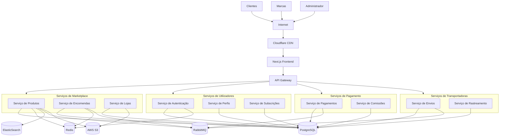

```mermaid
graph TD
    %% Utilizadores
    Clientes[Clientes] --> Internet
    Marcas[Marcas] --> Internet
    Admin[Administrador] --> Internet
    
    %% Internet e CDN
    Internet[Internet] --> CDN
    CDN[Cloudflare CDN] --> Frontend
    
    %% Frontend
    Frontend[Next.js Frontend] --> APIGateway
    
    %% API Gateway
    APIGateway[API Gateway] --> ServicosMarketplace
    APIGateway --> ServicosUtilizadores
    APIGateway --> ServicosPagamento
    APIGateway --> ServicosTransportadoras
    
    %% Microserviços
    subgraph ServicosMarketplace[Serviços de Marketplace]
        Produtos[Serviço de Produtos]
        Encomendas[Serviço de Encomendas]
        Lojas[Serviço de Lojas]
    end
    
    subgraph ServicosUtilizadores[Serviços de Utilizadores]
        Autenticacao[Serviço de Autenticação]
        Perfis[Serviço de Perfis]
        Subscricoes[Serviço de Subscrições]
    end
    
    subgraph ServicosPagamento[Serviços de Pagamento]
        Pagamentos[Serviço de Pagamentos]
        Comissoes[Serviço de Comissões]
    end
    
    subgraph ServicosTransportadoras[Serviços de Transportadoras]
        Envios[Serviço de Envios]
        Rastreamento[Serviço de Rastreamento]
    end
    
    %% Base de Dados
    Produtos --> PostgreSQL
    Encomendas --> PostgreSQL
    Lojas --> PostgreSQL
    Autenticacao --> PostgreSQL
    Perfis --> PostgreSQL
    Subscricoes --> PostgreSQL
    Pagamentos --> PostgreSQL
    Comissoes --> PostgreSQL
    Envios --> PostgreSQL
    Rastreamento --> PostgreSQL
    
    %% Cache
    Produtos --> Redis
    Encomendas --> Redis
    Autenticacao --> Redis
    
    %% Pesquisa
    Produtos --> ElasticSearch
    
    %% Mensagens
    Produtos --> RabbitMQ
    Encomendas --> RabbitMQ
    Pagamentos --> RabbitMQ
    Envios --> RabbitMQ
    
    %% Armazenamento
    Produtos --> S3
    Lojas --> S3
    
    %% Bases de Dados e Serviços
    PostgreSQL[(PostgreSQL)]
    Redis[(Redis)]
    ElasticSearch[(ElasticSearch)]
    RabbitMQ[(RabbitMQ)]
    S3[(AWS S3)]
```
