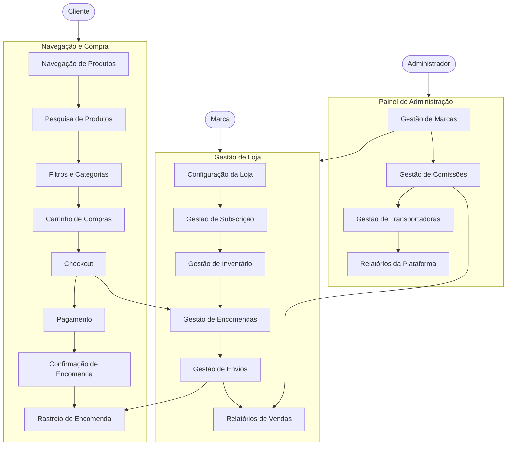
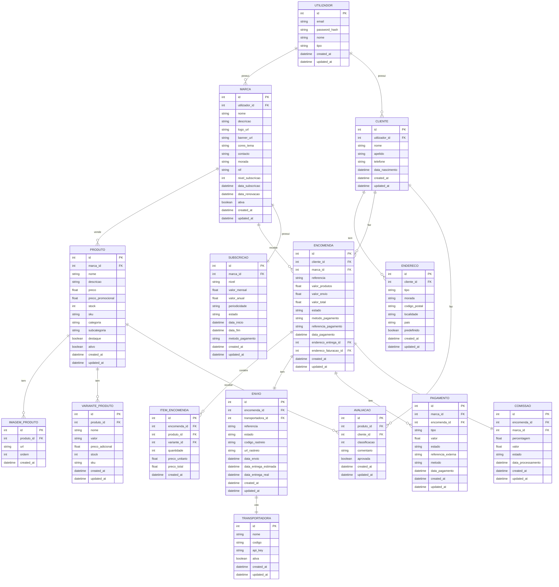

# Diagrama de Fluxo de Dados - Rota do Comércio

```mermaid
flowchart TD
    %% Utilizadores
    Cliente([Cliente]) --> Navegacao
    Marca([Marca]) --> GestaoLoja
    Admin([Administrador]) --> PainelAdmin
    
    %% Fluxos Principais
    subgraph Navegacao[Navegação e Compra]
        direction TB
        NavProdutos[Navegação de Produtos] --> Pesquisa
        Pesquisa[Pesquisa de Produtos] --> Filtros
        Filtros[Filtros e Categorias] --> Carrinho
        Carrinho[Carrinho de Compras] --> Checkout
        Checkout[Checkout] --> Pagamento
        Pagamento[Pagamento] --> ConfirmacaoEncomenda
        ConfirmacaoEncomenda[Confirmação de Encomenda] --> RastreioEncomenda
        RastreioEncomenda[Rastreio de Encomenda]
    end
    
    subgraph GestaoLoja[Gestão de Loja]
        direction TB
        ConfigLoja[Configuração da Loja] --> GestaoSubscricao
        GestaoSubscricao[Gestão de Subscrição] --> GestaoInventario
        GestaoInventario[Gestão de Inventário] --> GestaoEncomendas
        GestaoEncomendas[Gestão de Encomendas] --> GestaoEnvios
        GestaoEnvios[Gestão de Envios] --> RelatoriosVendas
        RelatoriosVendas[Relatórios de Vendas]
    end
    
    subgraph PainelAdmin[Painel de Administração]
        direction TB
        GestaoMarcas[Gestão de Marcas] --> GestaoComissoes
        GestaoComissoes[Gestão de Comissões] --> GestaoTransportadoras
        GestaoTransportadoras[Gestão de Transportadoras] --> RelatoriosPlataforma
        RelatoriosPlataforma[Relatórios da Plataforma]
    end
    
    %% Interações entre fluxos
    Checkout --> GestaoEncomendas
    GestaoEnvios --> RastreioEncomenda
    GestaoMarcas --> GestaoLoja
    GestaoComissoes --> RelatoriosVendas
```

# Diagrama de Arquitetura de Dados - Rota do Comércio

```mermaid
erDiagram
    UTILIZADOR {
        int id PK
        string email
        string password_hash
        string nome
        string tipo
        datetime created_at
        datetime updated_at
    }
    
    MARCA {
        int id PK
        int utilizador_id FK
        string nome
        string descricao
        string logo_url
        string banner_url
        string cores_tema
        string contacto
        string morada
        string nif
        int nivel_subscricao
        datetime data_subscricao
        datetime data_renovacao
        boolean ativa
        datetime created_at
        datetime updated_at
    }
    
    PRODUTO {
        int id PK
        int marca_id FK
        string nome
        string descricao
        float preco
        float preco_promocional
        int stock
        string sku
        string categoria
        string subcategoria
        boolean destaque
        boolean ativo
        datetime created_at
        datetime updated_at
    }
    
    IMAGEM_PRODUTO {
        int id PK
        int produto_id FK
        string url
        int ordem
        datetime created_at
    }
    
    VARIANTE_PRODUTO {
        int id PK
        int produto_id FK
        string nome
        string valor
        float preco_adicional
        int stock
        string sku
        datetime created_at
        datetime updated_at
    }
    
    CLIENTE {
        int id PK
        int utilizador_id FK
        string nome
        string apelido
        string telefone
        datetime data_nascimento
        datetime created_at
        datetime updated_at
    }
    
    ENDERECO {
        int id PK
        int cliente_id FK
        string tipo
        string morada
        string codigo_postal
        string localidade
        string pais
        boolean predefinido
        datetime created_at
        datetime updated_at
    }
    
    ENCOMENDA {
        int id PK
        int cliente_id FK
        int marca_id FK
        string referencia
        float valor_produtos
        float valor_envio
        float valor_total
        string estado
        string metodo_pagamento
        string referencia_pagamento
        datetime data_pagamento
        int endereco_entrega_id FK
        int endereco_faturacao_id FK
        datetime created_at
        datetime updated_at
    }
    
    ITEM_ENCOMENDA {
        int id PK
        int encomenda_id FK
        int produto_id FK
        int variante_id FK
        int quantidade
        float preco_unitario
        float preco_total
        datetime created_at
    }
    
    ENVIO {
        int id PK
        int encomenda_id FK
        int transportadora_id FK
        string referencia
        string estado
        string codigo_rastreio
        string url_rastreio
        datetime data_envio
        datetime data_entrega_estimada
        datetime data_entrega_real
        datetime created_at
        datetime updated_at
    }
    
    TRANSPORTADORA {
        int id PK
        string nome
        string codigo
        string api_key
        boolean ativa
        datetime created_at
        datetime updated_at
    }
    
    SUBSCRICAO {
        int id PK
        int marca_id FK
        string nivel
        float valor_mensal
        float valor_anual
        string periodicidade
        string estado
        datetime data_inicio
        datetime data_fim
        string metodo_pagamento
        datetime created_at
        datetime updated_at
    }
    
    PAGAMENTO {
        int id PK
        int marca_id FK
        int encomenda_id FK
        string tipo
        float valor
        string estado
        string referencia_externa
        string metodo
        datetime data_pagamento
        datetime created_at
        datetime updated_at
    }
    
    COMISSAO {
        int id PK
        int encomenda_id FK
        int marca_id FK
        float percentagem
        float valor
        string estado
        datetime data_processamento
        datetime created_at
        datetime updated_at
    }
    
    AVALIACAO {
        int id PK
        int produto_id FK
        int cliente_id FK
        int classificacao
        string comentario
        boolean aprovada
        datetime created_at
        datetime updated_at
    }
    
    UTILIZADOR ||--o{ MARCA : "possui"
    UTILIZADOR ||--o{ CLIENTE : "possui"
    MARCA ||--o{ PRODUTO : "vende"
    MARCA ||--o{ ENCOMENDA : "recebe"
    MARCA ||--|| SUBSCRICAO : "possui"
    PRODUTO ||--o{ IMAGEM_PRODUTO : "tem"
    PRODUTO ||--o{ VARIANTE_PRODUTO : "tem"
    PRODUTO ||--o{ AVALIACAO : "recebe"
    CLIENTE ||--o{ ENDERECO : "tem"
    CLIENTE ||--o{ ENCOMENDA : "faz"
    CLIENTE ||--o{ AVALIACAO : "faz"
    ENCOMENDA ||--o{ ITEM_ENCOMENDA : "contém"
    ENCOMENDA ||--|| ENVIO : "tem"
    ENCOMENDA ||--o{ PAGAMENTO : "tem"
    ENCOMENDA ||--|| COMISSAO : "gera"
    ENVIO ||--|| TRANSPORTADORA : "usa"
```

# Diagrama de Componentes - Rota do Comércio

```mermaid
graph TB
    %% Componentes Principais
    subgraph Frontend
        NextJS[Next.js App]
        TailwindCSS[Tailwind CSS]
        Redux[Redux Toolkit]
        ReactHookForm[React Hook Form]
    end
    
    subgraph Backend
        NestJS[NestJS Framework]
        GraphQL[GraphQL API]
        REST[REST API]
        Prisma[Prisma ORM]
    end
    
    subgraph Databases
        PostgreSQL[(PostgreSQL)]
        Redis[(Redis)]
        ElasticSearch[(ElasticSearch)]
    end
    
    subgraph Infrastructure
        Docker[Docker]
        Kubernetes[Kubernetes]
        S3[AWS S3]
        CloudFront[Cloudflare]
        RabbitMQ[RabbitMQ]
    end
    
    subgraph Integrations
        Stripe[Stripe]
        PayPal[PayPal]
        Multibanco[Multibanco]
        CTT[CTT API]
        DPD[DPD API]
        GLS[GLS API]
        Analytics[Google Analytics]
    end
    
    %% Conexões
    NextJS --> TailwindCSS
    NextJS --> Redux
    NextJS --> ReactHookForm
    
    NextJS --> REST
    NextJS --> GraphQL
    
    NestJS --> REST
    NestJS --> GraphQL
    NestJS --> Prisma
    
    Prisma --> PostgreSQL
    NestJS --> Redis
    NestJS --> ElasticSearch
    NestJS --> RabbitMQ
    
    NestJS --> Stripe
    NestJS --> PayPal
    NestJS --> Multibanco
    NestJS --> CTT
    NestJS --> DPD
    NestJS --> GLS
    
    NextJS --> CloudFront
    NextJS --> S3
    NextJS --> Analytics
    
    NestJS --> Docker
    Docker --> Kubernetes
```
